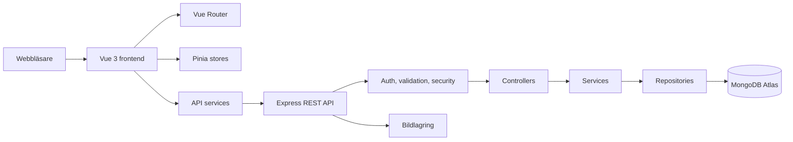
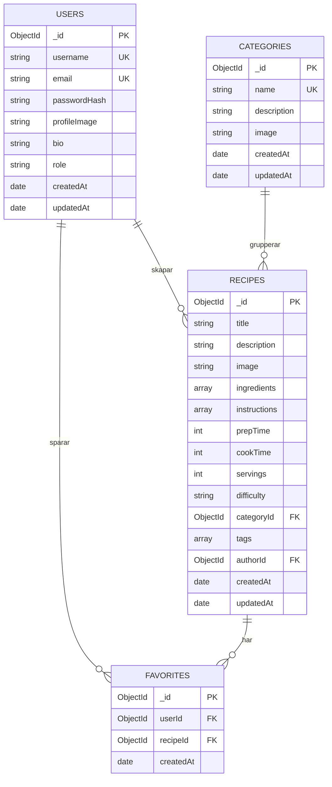

# Receptbanken: arkitektur och utvecklingsplan

## 1. Projektöversikt

Receptbanken är en responsiv webbapplikation där besökare kan upptäcka, söka och filtrera recept. Inloggade användare kan skapa recept, hantera sin profil och spara favoriter. Administratörer får ett separat gränssnitt för statistik, användare, recept och kategorier.

Projektet genomförs som ett TE4-projekt, men struktureras som en realistisk produkt med tydliga lager, servervalidering, behörighetskontroll, testning och dokumentation.

## 2. Mål och avgränsning

### Mål

- Göra recept lätta att hitta med sökning, filter, sortering och pagination.
- Ge användare ett tryggt sätt att skapa och organisera egna recept.
- Säkerställa att administrativa funktioner skyddas av backendens behörighetskontroll.
- Bygga en kodbas som är begriplig att vidareutveckla och demonstrera.

### Målgrupper

- Besökare som vill hitta matinspiration.
- Registrerade användare som vill samla och dela recept.
- Administratörer som modererar innehåll och sköter plattformen.

### Utanför första versionen

- Sociala följfunktioner, kommentarer och realtidsnotiser.
- Betalningar och kommersiella abonnemang.
- Automatisk bildigenkänning av ingredienser.

## 3. Fastställd teknikstack

| Område | Teknik | Beslut |
|---|---|---|
| Webbklient | Vue 3, TypeScript, Vite | Behåll befintligt frontendskal |
| Routing | Vue Router | Skyddade route guards för inloggning och admin |
| Klientstate | Pinia | Auth-state och UI-state; serverdata hämtas via services |
| API | Node.js, Express, TypeScript | Ersätter den nuvarande minimala Python-proben |
| Databas | MongoDB Atlas, Mongoose | Scheman, index och relationsreferenser |
| Auth | Argon2id + HTTP-only sessionscookie | Sessioner lagras server-side och kan återkallas |
| Validering | Zod | Samma tydliga valideringsmodell i API-lager |
| Säkerhet | Helmet, CORS, rate limiting, cookie-skydd | Konfigureras via miljövariabler |
| Testning | Vitest, Vue Test Utils, Supertest | Enhetstest och API-integrationstest |
| Bilder | Lokal lagring i utveckling, objektlagring i produktion | MIME-, storleks- och innehållskontroll |

### Tekniskt beslut om autentisering

HTTP-only sessionscookies väljs framför tokens i `localStorage`. Det minskar risken att en XSS-sårbarhet läcker autentiseringsuppgifter. Cookie-inställningarna blir `HttpOnly`, `SameSite=Lax` och `Secure` i produktion. Muterande cross-site-anrop skyddas av CSRF-token när frontend och API distribueras på separata origin.

## 4. Systemarkitektur



### Lageransvar

- **Views/components:** presenterar UI och skickar användarhändelser vidare.
- **Stores:** håller klientens autentiserings- och gränssnittstillstånd.
- **Services:** samlar HTTP-anrop och normaliserar API-fel.
- **Routes:** kopplar URL och HTTP-metod till rätt controller.
- **Controllers:** översätter HTTP till domänanrop och svar.
- **Services:** innehåller affärsregler, till exempel ägarskap och favoritregler.
- **Repositories:** innehåller MongoDB-frågor och indexvänliga filter.
- **Middleware:** autentisering, rollkontroll, validering, rate limiting och felhantering.

## 5. Föreslagen mappstruktur

```text
receptbanken/
├── src/
│   ├── assets/
│   ├── components/
│   ├── layouts/
│   ├── router/
│   ├── services/
│   ├── stores/
│   ├── types/
│   ├── views/
│   ├── App.vue
│   └── main.ts
├── backend/
│   ├── src/
│   │   ├── config/
│   │   ├── controllers/
│   │   ├── middleware/
│   │   ├── models/
│   │   ├── repositories/
│   │   ├── routes/
│   │   ├── services/
│   │   ├── types/
│   │   ├── validation/
│   │   ├── app.ts
│   │   └── server.ts
│   └── tests/
├── docs/
│   └── ARKITEKTUR.md
├── public/
├── .env.example
├── package.json
└── README.md
```

Den nuvarande `backend/main.py` och `backend/database.py` fungerar endast som en tidig anslutningskontroll. De ersätts stegvis när Node/Express-backenden byggs; ingen frontend ska kopplas till en parallell, ofullständig API-implementation.

## 6. Databasdesign



### Databaseregler och index

- `users.email` är obligatoriskt, normaliseras till lowercase och har unikt index.
- `users.username` är obligatoriskt och har unikt index.
- `users.passwordHash` returneras aldrig i API-responsen.
- `recipes.title`, `description`, `tags` och ingrediensnamn söks via textindex eller en kontrollerad sökstrategi.
- `recipes.categoryId`, `authorId`, `difficulty`, `createdAt` och `cookTime` indexeras för filter och sortering.
- `favorites` har ett sammansatt unikt index på `{ userId: 1, recipeId: 1 }`, vilket förhindrar dubbla favoriter även vid samtidiga anrop.
- `categories.name` är obligatoriskt och unikt.
- Referenser raderas eller hanteras uttryckligen i services, aldrig genom att lita på frontendens state.

## 7. API-översikt

Alla svar använder formen `{ success, data?, message?, errors? }`. Fel innehåller inte stacktraces, lösenord eller databasdetaljer.

| Område | Endpoint | Behörighet |
|---|---|---|
| Auth | `POST /api/auth/register` | Publik |
| Auth | `POST /api/auth/login` | Publik, rate limited |
| Auth | `POST /api/auth/logout` | Inloggad |
| Auth | `GET /api/auth/me` | Inloggad |
| Auth | `POST /api/auth/forgot-password` | Publik, generiskt svar |
| Auth | `POST /api/auth/reset-password` | Giltig reset-token |
| Recept | `GET /api/recipes` | Publik, paginerad |
| Recept | `GET /api/recipes/:id` | Publik |
| Recept | `POST /api/recipes` | Inloggad |
| Recept | `PUT /api/recipes/:id` | Ägare eller admin |
| Recept | `DELETE /api/recipes/:id` | Ägare eller admin |
| Kategorier | `GET /api/categories` | Publik |
| Kategorier | `POST/PUT/DELETE /api/categories...` | Admin |
| Profil | `GET /api/users/:id` | Publik profilinformation |
| Profil | `PUT /api/users/:id` | Ägare eller admin |
| Favoriter | `GET /api/users/:id/favorites` | Ägare eller admin |
| Favoriter | `POST/DELETE /api/users/:id/favorites/:recipeId` | Ägare eller admin |
| Admin | `GET /api/admin/dashboard` | Admin |
| Admin | `GET /api/admin/users` | Admin |
| Admin | `DELETE /api/admin/users/:id` | Admin |
| Admin | `GET /api/admin/recipes` | Admin |
| Admin | `DELETE /api/admin/recipes/:id` | Admin |

### Sökning

`GET /api/recipes?search=pasta&category=...&difficulty=easy&maxTime=30&ingredients=tomat&tags=vegetarisk&sort=newest&page=1&limit=12`

API:t validerar varje parameter, begränsar `limit` till exempelvis 48 och returnerar metadata: `page`, `limit`, `total` och `pages`. Filtrering sker i MongoDB, inte genom att ladda hela databasen till webbläsaren.

## 8. Frontendens sidkarta

- Publikt: `Home`, `Recipes`, `RecipeDetails`, `Categories`, `SearchResults`, `About`.
- Auth: `Login`, `Register`, `ForgotPassword`, `ResetPassword`.
- Användare: `Dashboard`, `Profile`, `EditProfile`, `MyRecipes`, `CreateRecipe`, `EditRecipe`, `Favorites`, `Settings`.
- Admin: `AdminDashboard`, `AdminUsers`, `AdminRecipes`, `AdminCategories`.

Återanvändbara byggblock blir bland annat `Navbar`, `RecipeCard`, `RecipeGrid`, `SearchBar`, `FilterPanel`, `Pagination`, `FavoriteButton`, `RecipeForm`, `ProfileCard`, `Toast`, `LoadingState`, `ErrorState`, `EmptyState` och `AdminSidebar`.

## 9. Säkerhetsarkitektur

- Backendens session avgör alltid identitet och roll; frontendens rollfält är endast presentation.
- `requireAuth` och `requireRole('admin')` placeras efter sessionmiddleware på skyddade routes.
- Zod-scheman stoppar ogiltiga ObjectIds, mass assignment och oväntade fält.
- Helmet, strikt CORS, rate limiting och parametriserade Mongoose-frågor används som standard.
- Uppladdningar tillåter endast definierade bildtyper och storlekar; filnamn genereras av servern.
- Produktionsbilder lagras i S3-kompatibel objektlagring eller Cloudinary, inte i webbserverns lokala filsystem.
- Lösenordsåterställning använder kortlivad, hashad engångstoken och generiskt svar för att undvika kontoenumerering.

## 10. Utvecklingsroadmap

1. **Analys och krav:** denna arkitektur, krav, user stories, use cases och acceptanskriterier.
2. **Teknisk grund:** Express-app, TypeScript-konfiguration, miljövariabler, MongoDB-anslutning och gemensam felhantering.
3. **Datamodeller:** User, Recipe, Category och Favorite med index och repositories.
4. **Auth:** registrering, inloggning, session, logout, `me`, roller och lösenordsreset-arkitektur.
5. **Recept-API:** CRUD, ägarskap, kategorier, validering, sökning, filter, sortering och pagination.
6. **Frontendgrund:** router, Pinia, API-klient, designsystem, layout och svenska UI-texter.
7. **Användarflöden:** recept, favoriter, profiler och dashboard.
8. **Admin:** statistik, användare, recept och kategorier med responsiv adminvy.
9. **Testning och säkerhet:** API-, komponent- och flödestester samt kontroll av behörighetsgränser.
10. **Dokumentation och deployment:** README, `.env.example`, API-referens, diagramsamling och produktionsinstruktioner.

## 11. Git- och kvalitetsprinciper

Arbeta från `main` via `develop` och kortlivade feature-branches, exempelvis `feature/auth` och `feature/recipes`. Commitmeddelanden ska beskriva en avgränsad förändring, till exempel `feat(auth): add session login` eller `test(recipes): cover ownership checks`.

Varje fas avslutas med körbar verifiering. En funktion räknas som klar först när dess backendregel, frontendflöde, felstate och relevanta testfall finns på plats.
